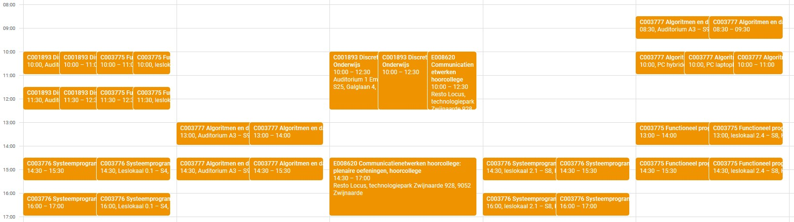
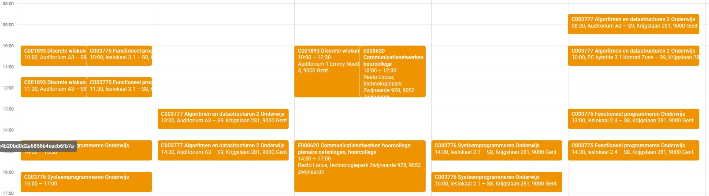

# TORGAX (calendar deduplicator)

TORGAX is a service that exists for one purpose: deduplicating Centauro calendar events.

## Before

## After

## How to use it?

Go to https://centauro.ugent.be/kalender/mijnKalender, click "Export", copy
the iCalendar URL. It should look something like `https://centauro.ugent.be/calendar/ical/764efa883dda1e11db47671c4a3bbd9e`.
Paste the token (here `764efa883dda1e11db47671c4a3bbd9e`) after `https://torgax.zeus.gent`,
then add a slash and then some text, so it becomes a URL like
`https://torgax.zeus.gent/764efa883dda1e11db47671c4a3bbd9e/torgaxisamazing`.